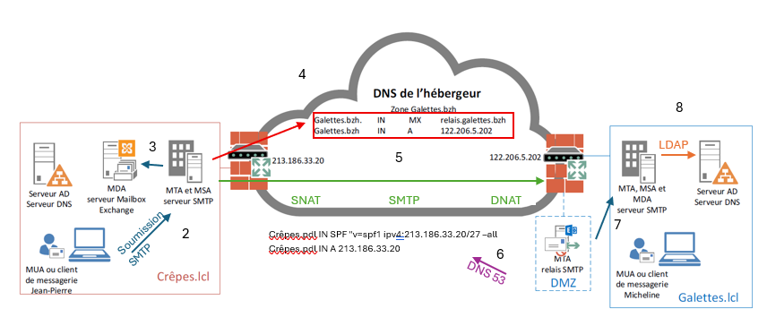

<!-- SOMMAIRE FLOTTANT -->
<nav class="lesson-toc" aria-label="Sommaire de la leçon">
    

        📋
        Plan
    

    

        <h3 class="lesson-toc__title">Sommaire</h3>
        <ol class="lesson-toc__list">
            <li><a href="#intro">1. Introduction</a></li>
            <li><a href="#roles">2. Les quatre rôles fondamentaux</a></li>
            <li><a href="#protocoles">3. Protocoles et ports</a></li>
            <li><a href="#trajet">4. Trajet d'un e-mail</a>
                <ol>
                    <li><a href="#etape1">1. Rédaction et envoi</a></li>
                    <li><a href="#etape4">4. Résolution DNS</a></li>
                    <li><a href="#etape8">8. Localisation de la boîte</a></li>
                </ol>
            </li>
            <li><a href="#schema">5. Schéma récapitulatif</a></li>
            <li><a href="#points-cles">6. Points clés à retenir</a></li>
        </ol>
    

</nav>

<!-- ==================== SECTION 1 : INTRODUCTION ==================== -->
<section id="intro-content">
<h2 id="intro">1. Introduction</h2>

La messagerie électronique repose sur une chaîne de composants bien définis qui collaborent pour acheminer un e-mail de l'expéditeur au destinataire. Comprendre cette chaîne est indispensable pour administrer, dépanner et sécuriser un système de messagerie en entreprise.

</section>

<!-- ==================== SECTION 2 : ROLES ==================== -->
<section id="roles-content">
<h2 id="roles">2. Les quatre rôles fondamentaux</h2>

Le fonctionnement de la messagerie repose sur une chaîne d'agents spécialisés. Voici le récapitulatif de leurs fonctions respectives :

| Rôle | Explication technique | Ports typiques | Exemples |
| :--- | :--- | :--- | :--- |
| **MUA** (Mail User Agent) | Logiciel client utilisé par l'utilisateur final pour rédiger, envoyer et lire ses e-mails. | — | Outlook, Thunderbird, Gmail (Web) |
| **MSA** (Mail Submission Agent) | Premier maillon du serveur qui reçoit le message du MUA pour l'injecter dans le réseau. | 587 (Standard), 465 (SSL) | Connecteur de réception SMTP |
| **MTA** (Mail Transfer Agent) | Serveur responsable du transport et de l'acheminement du message entre différents domaines via Internet. | 25 (SMTP inter-serveurs) | Postfix, Microsoft Exchange, Sendmail |
| **MDA** (Mail Delivery Agent) | Composant final qui dépose physiquement le message dans la boîte aux lettres de l'utilisateur sur le serveur. | — | Exchange Mailbox, Dovecot |

</section>

<!-- ==================== SECTION 3 : PROTOCOLES ==================== -->
<section id="protocoles-content">
<h2 id="protocoles">3. Protocoles et ports</h2>

<table>
    <thead>
        <tr><th>Protocole</th><th>Rôle</th><th>Port non sécurisé</th><th>Port sécurisé (TLS/SSL)</th></tr>
    </thead>
    <tbody>
        <tr><td>SMTP (MTA → MTA)</td><td>Transport de serveur à serveur</td><td>25, 2525</td><td>—</td></tr>
        <tr><td>SMTP Soumission (MUA → MSA)</td><td>Envoi du client vers le serveur, authentifié</td><td>587</td><td>587 / 465</td></tr>
        <tr><td>POP3</td><td>Récupération avec téléchargement local et suppression du serveur</td><td>110</td><td>995</td></tr>
        <tr><td>IMAP4</td><td>Récupération avec synchronisation (les mails restent sur le serveur)</td><td>143</td><td>993</td></tr>
        <tr><td>HTTP / HTTPS</td><td>Accès webmail, Autodiscover, API</td><td>80</td><td>443</td></tr>
        <tr><td>MAPI / HTTPS</td><td>Accès Exchange complet (mails, calendriers, contacts)</td><td>—</td><td>443</td></tr>
        <tr><td>ActiveSync / HTTPS</td><td>Synchronisation mobile (Exchange Online, smartphones)</td><td>—</td><td>443</td></tr>
    </tbody>
</table>

> **POP3 vs IMAP4 :** POP3 télécharge et supprime (les mails ne sont accessibles que sur l'appareil local). IMAP4 synchronise (les mails restent sur le serveur et sont accessibles depuis plusieurs appareils).
</section>

<!-- ==================== SECTION 4 : TRAJET ==================== -->
<section id="trajet-content">
<h2 id="trajet">4. Trajet d'un e-mail — Exemple pas à pas</h2>

<strong>Scénario :</strong> Jean-Pierre (domaine <code>crepes.pdl</code>) envoie un e-mail à Micheline (domaine <code>galettes.bzh</code>).

<h3 id="etape1">Étape 1 — Rédaction et envoi</h3>

Jean-Pierre rédige son e-mail dans son <strong>MUA</strong> (ex. Outlook) et clique sur Envoyer.

<h3>Étape 2 — Soumission au serveur</h3>

Le MUA transmet le message au <strong>MSA</strong> de son serveur via SMTP (port 587 ou 465). Le MSA prend en charge le message pour l'injecter dans le réseau.

<h3>Étape 3 — Dépôt sur le MDA et transmission au MTA</h3>

Le message est copié sur le <strong>MDA</strong> local. Simultanément, le <strong>MSA</strong> transmet le message au <strong>MTA</strong> (SMTP, port 25) pour qu'il soit acheminé vers l'extérieur.

<h3 id="etape4">Étape 4 — Résolution DNS</h3>

Le <strong>MTA</strong> de Jean-Pierre effectue une requête DNS (port 53) pour trouver l'<strong>enregistrement MX</strong> du domaine <code>galettes.bzh</code>. Cet enregistrement indique quelle adresse IP joindre pour livrer l'e-mail.

<h3>Étape 5 — Envoi vers le domaine destinataire</h3>

Le MTA reçoit l'IP publique du routeur pare-feu de <code>galettes.bzh</code> et lui envoie le message via SMTP. Le routeur effectue un <strong>DNAT</strong> pour rediriger la connexion vers le relais SMTP situé en DMZ.

> **DNAT (Destination NAT) :** redirige le trafic entrant vers le bon serveur interne (ici, le relais SMTP en DMZ).

<h3>Étape 6 — Vérification anti-spam côté destinataire</h3>

Le relais SMTP en DMZ vérifie l'authenticité de l'expéditeur en interrogeant le DNS de <code>crepes.pdl</code> pour lire son <strong>enregistrement SPF</strong>. Cet enregistrement indique quels serveurs sont autorisés à envoyer des e-mails pour ce domaine.

<h3>Étape 7 — Analyse de sécurité</h3>

Le relais effectue une analyse <strong>antivirus et antispam</strong> et vérifie la réputation du domaine expéditeur (blacklists). Si tout est conforme, le message est transmis au <strong>MTA interne</strong> via SMTP (port 25).

<h3 id="etape8">Étape 8 — Localisation de la boîte aux lettres</h3>

Le <strong>MTA interne</strong> interroge l'annuaire Active Directory via <strong>LDAP</strong> (port 389) pour localiser le serveur qui héberge la boîte aux lettres de Micheline. Il y dépose ensuite le message.

> **LDAP (Lightweight Directory Access Protocol) :** protocole permettant d'interroger un annuaire pour retrouver des informations sur un utilisateur ou une ressource.

<h3>Étape 9 — Récupération par Micheline</h3>

Micheline ouvre son client de messagerie (MUA), qui récupère le message depuis le serveur selon le protocole configuré (POP3, IMAP4, HTTPS, MAPI, ActiveSync).

</section>

<!-- ==================== SECTION 5 : SCHEMA ==================== -->
<section id="schema-content">
<h2 id="schema">5. Schéma récapitulatif des rôles</h2>
<pre><code>[MUA expéditeur] → [MSA] → [MTA expéditeur] ──Internet──► [Relais DMZ] → [MTA destinataire] → [MDA] → [MUA destinataire]</code></pre>
</section>

<!-- ==================== SECTION 6 : POINTS CLES ==================== -->
<section id="points-cles-content">
<h2 id="points-cles">6. Points clés à retenir</h2>

- Le **MUA** est le seul composant visible de l'utilisateur final. Tous les autres opèrent côté serveur.
- Le **port 25** est réservé aux échanges entre serveurs (MTA ↔ MTA). Les clients utilisent le **port 587** pour soumettre leurs messages.
- Le **SPF** est un mécanisme anti-usurpation : il déclare dans le DNS quels serveurs sont autorisés à envoyer pour un domaine.
- Le **DNAT** et **SNAT** sont des mécanismes de translation d'adresses opérés par le routeur/pare-feu pour contrôler les flux entrants et sortants.
- La **DMZ** (zone démilitarisée) est une zone réseau isolée où sont placés les serveurs accessibles depuis Internet, pour protéger le réseau interne.

</section>
