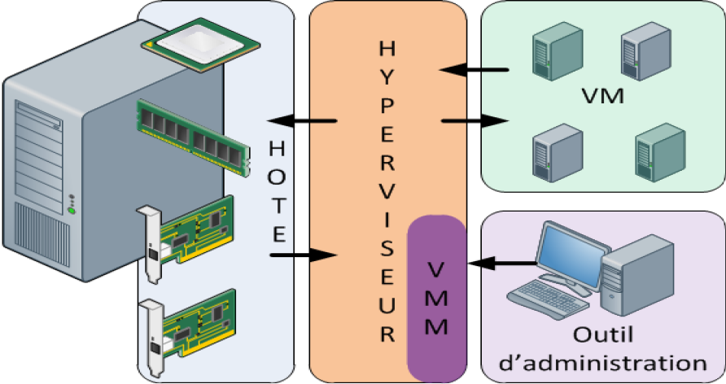

<!-- SOMMAIRE FLOTTANT -->
<nav class="lesson-toc" aria-label="Sommaire de la leçon">
    

        📋
        Plan
    

    

        <h3 class="lesson-toc__title">Sommaire</h3>
        <ol class="lesson-toc__list">
            <li><a href="#definition">1. Définition et concepts fondamentaux</a>
                <ol>
                    <li><a href="#histo">Repères historiques</a></li>
                    <li><a href="#avantages">Avantages et inconvénients</a></li>
                </ol>
            </li>
            <li><a href="#hyperviseurs">2. Les hyperviseurs</a>
                <ol>
                    <li><a href="#type1">Type 1 — Bare Metal</a></li>
                    <li><a href="#type2">Type 2 — Hosted</a></li>
                </ol>
            </li>
            <li><a href="#solutions">3. Solutions du marché</a></li>
            <li><a href="#postes">4. Poste de travail (Workstation)</a></li>
            <li><a href="#serveurs">5. Virtualisation de serveurs</a></li>
            <li><a href="#vsphere">6. Infrastructure vSphere</a>
                <ol>
                    <li><a href="#fonctions">Fonctions avancées</a></li>
                    <li><a href="#licences">Licences vSphere</a></li>
                </ol>
            </li>
            <li><a href="#reseau">7. Gestion des réseaux</a></li>
            <li><a href="#stockage">8. Gestion du stockage</a></li>
            <li><a href="#datacenter">9. Gestion du datacenter</a></li>
            <li><a href="#modeles">10. Modèles de VM</a></li>
            <li><a href="#migration">11. Migration de VM</a></li>
        </ol>
    

</nav>

<!-- ==================== SECTION 1 : DEFINITION ==================== -->
<section id="definition-content">
<h2 id="definition">1. Définition et concepts fondamentaux</h2>

La virtualisation est une technique qui permet de faire fonctionner plusieurs environnements indépendants — appelés <strong>machines virtuelles (VM)</strong> — sur un même matériel physique. Elle repose sur un logiciel appelé <strong>hyperviseur</strong>, qui découpe les ressources physiques (CPU, RAM, stockage, réseau), les attribue aux différentes VM et isole chaque VM des autres.

<strong>Objectif : mutualiser le matériel, optimiser son utilisation et simplifier la gestion des systèmes.</strong>

> **Exemple :** un serveur avec 64 Go de RAM peut héberger 4 VM de 16 Go chacune, chacune avec un OS différent (Windows, Linux) et un rôle différent (serveur web, base de données, messagerie).

<strong>Cas d'usage principaux :</strong>

- Serveurs d'infrastructure (locaux ou cloud)
- Environnements de test et de compatibilité
- Plan de Reprise d'Activité (PRA)
- Formation et labos

<h3 id="histo">Repères historiques</h3>

| Période | Événement |
| :--- | :--- |
| 1960-70 | IBM introduit la virtualisation sur ses mainframes |
| Années 90 | Émulateurs de systèmes (Amiga, Atari...) |
| 2000 | VMware démocratise la virtualisation x86 |
| 2006 | Intel et AMD intègrent la virtualisation dans leurs CPU (VT-x / AMD-V) |
| 2007 | Xen rejoint Citrix, KVM intégré au noyau Linux |
| 2009 | Le nombre de serveurs virtuels dépasse celui des serveurs physiques |

<h3 id="avantages">Avantages et inconvénients</h3>

| Avantages | Inconvénients |
| :--- | :--- |
| Optimisation du matériel (meilleur taux de charge) | Forte dépendance à l'hyperviseur : un hôte en panne impacte toutes ses VM |
| Réduction des coûts matériels et de gestion | Investissement initial important (matériel + licences) |
| Flexibilité : snapshots, déploiement rapide, migration | Administration plus complexe (sauvegardes, réseau, PRA) |
| Green IT : moins de serveurs physiques, moins d'énergie | — |

> **Exemple :** 10 serveurs physiques remplacés par 2 hôtes + SAN. Résultat : espace réduit, coûts réduits, meilleure disponibilité.

<h3>Domaines de virtualisation</h3>

| Domaine | Solutions courantes |
| :--- | :--- |
| Poste de travail | VMware Workstation, VirtualBox |
| Applications | Citrix, Microsoft App-V |
| Serveurs | ESXi, Hyper-V, KVM, Proxmox |
| VDI (bureaux virtuels) | Citrix Virtual Apps, VMware Horizon |
| Réseau | SDN (Software Defined Networking), NFV |
| Stockage | SAN/NAS virtuels, vSAN |
| Cloud | AWS, Azure, GCP |

</section>

<!-- ==================== SECTION 2 : HYPERVISEURS ==================== -->
<section id="hyperviseurs-content">
<h2 id="hyperviseurs">2. Les hyperviseurs</h2>

<h3 id="type1">Type 1 — Bare Metal</h3>

Installé <strong>directement sur le matériel</strong>, sans OS intermédiaire. C'est la solution de référence pour la production.

- **Exemples :** ESXi, Hyper-V, Xen, KVM
- **Usage :** datacenters, serveurs de production

<h3 id="type2">Type 2 — Hosted</h3>

Installé <strong>sur un système d'exploitation existant</strong> (Windows, Linux). Moins performant qu'un Type 1, mais simple à déployer.

- **Exemples :** VMware Workstation, VirtualBox
- **Usage :** tests, labos, formation

> **Règle simple :** test rapide ou labo → VirtualBox. ERP d'entreprise en production → VMware ESXi.

<h3>Virtualisation classique vs paravirtualisation</h3>

<strong>Virtualisation classique :</strong> la VM ignore qu'elle tourne sur un hyperviseur. Elle s'adresse aux périphériques virtuels présentés par l'hyperviseur comme s'ils étaient réels.

<strong>Paravirtualisation :</strong> la VM est modifiée pour communiquer directement avec l'hyperviseur via une interface optimisée. Résultat : meilleures performances, moins d'overhead.

</section>

<!-- ==================== SECTION 3 : SOLUTIONS ==================== -->
<section id="solutions-content">
<h2 id="solutions">3. Solutions du marché</h2>

<h3>Virtualisation de serveurs</h3>

| Acteur | Solution | Description |
| :--- | :--- | :--- |
| VMware | **ESXi** | Hyperviseur Type 1 (bare metal), base de toute infrastructure vSphere |
| VMware | **vCenter** | Console centrale de gestion multi-ESXi : clusters, HA, DRS, vMotion |
| VMware | **vSphere** | Suite complète (ESXi + vCenter + outils) |
| Microsoft | **Hyper-V** | Hyperviseur Type 1 intégré à Windows Server, référence en environnement Microsoft |
| Citrix | **XenServer** | Basé sur Xen, spécialisé dans le VDI (bureaux virtuels) |
| Red Hat | **KVM** | Hyperviseur open source intégré au noyau Linux, massivement utilisé dans le cloud (AWS, OpenStack, GCP) |
| — | **Proxmox VE** | Basé sur KVM + LXC, interface web complète, alternative libre à vSphere |
| — | **QEMU** | Émulateur + hyperviseur open source, souvent couplé à KVM pour l'accélération matérielle |

<h3>Virtualisation de poste de travail</h3>

| Acteur | Solution | Description |
| :--- | :--- | :--- |
| VMware | **Workstation** | Hyperviseur Type 2, Windows/Linux, idéal tests et labos |
| Oracle | **VirtualBox** | Hyperviseur Type 2, gratuit et open source, polyvalent |
| Microsoft | **Hyper-V (Windows 10/11 Pro)** | Version client de Hyper-V, fonctionnalités limitées par rapport à la version serveur |

</section>

<!-- ==================== SECTION 4 : POSTE DE TRAVAIL ==================== -->
<section id="postes-content">
<h2 id="postes">4. Virtualisation sur poste de travail (VMware Workstation)</h2>

VMware Workstation est un hyperviseur de Type 2 installé sur un OS hôte (Windows ou Linux). Chaque VM peut avoir son propre système d'exploitation, ses propres ressources et son propre réseau.

<strong>Usage typique :</strong> tests, labos, développement, formation.

<h3>Fonctionnalités clés</h3>

| Fonctionnalité | Description |
| :--- | :--- |
| **Snapshots** | Sauvegarder l'état d'une VM à un instant T pour y revenir en cas de problème |
| **Clone** | Copier rapidement une VM existante |
| **Réseaux virtuels** | Bridge, NAT, Host-Only |
| **Dossiers partagés** | Échange de fichiers entre l'hôte et la VM |
| **Accélération graphique** | Support 3D pour tests applicatifs |
| **Intégration vSphere** | Peut piloter certaines VM sur ESXi distant |

<h3>Types de réseau dans Workstation</h3>

| Mode | Comportement |
| :--- | :--- |
| **Bridge (pont)** | La VM apparaît comme une machine physique à part entière sur le réseau de l'hôte (elle obtient sa propre IP) |
| **NAT** | La VM partage l'IP de l'hôte pour accéder au réseau. L'extérieur ne voit que l'hôte |
| **Host-Only** | La VM communique uniquement avec l'hôte et les autres VM en mode host-only — aucun accès au réseau externe |

<h3>Avantages / Inconvénients</h3>

| Avantages | Inconvénients |
| :--- | :--- |
| Facile à installer, interface conviviale | Consomme beaucoup de ressources si plusieurs VM simultanées |
| Grande variété d'OS invités supportés | Moins performant qu'un hyperviseur Type 1 |
| Snapshots et clones pour tester sans risque | Licence payante (~200 €) |
| Idéal pour formation et labos | Pas adapté à la production |

</section>

<!-- ==================== SECTION 5 : SERVEURS ==================== -->
<section id="serveurs-content">
<h2 id="serveurs">5. Virtualisation de serveurs</h2>

<h3>Types de serveurs physiques</h3>

| Type | Caractéristiques | Avantages | Inconvénients |
| :--- | :--- | :--- | :--- |
| **Tour** | Format classique, au sol | Faible coût, simple à mettre en place | Faible densité, câblage moins propre |
| **Rack (1U/2U...)** | S'intègre en baie 19" (jusqu'à ~42U par armoire) | Standard datacenter, câblage propre | Nécessite baie, PDU, réseau structuré |
| **Lame (Blade)** | Très forte densité dans un châssis partagé | Mutualise alimentation et refroidissement, densité maximale | Châssis coûteux, forte concentration thermique |

<h3>Prérequis CPU pour la virtualisation</h3>

| Fonctionnalité | Intel | AMD | Rôle |
| :--- | :--- | :--- | :--- |
| **Virtualisation matérielle** | VT-x | AMD-V | Permet l'exécution d'OS invités — prérequis absolu |
| **SLAT** (Second Level Address Translation) | EPT | NPT / RVI | Tables de pages matérielles pour les VM — réduit l'overhead mémoire et améliore les performances |

> **IMPORTANT :** Ces options doivent être activées dans le BIOS/UEFI avant d'installer un hyperviseur.

</section>

<!-- ==================== SECTION 6 : VSPHERE ==================== -->
<section id="vsphere-content">
<h2 id="vsphere">6. Infrastructure vSphere (VMware)</h2>

    

        <h3>Composantes principales</h3>
        <table>
            <thead>
                <tr>
                    <th>Élément</th>
                    <th>Rôle</th>
                </tr>
            </thead>
            <tbody>
                <tr>
                    <td><strong>vSphere</strong></td>
                    <td>Nom de la suite complète de virtualisation VMware (ESXi + vCenter + outils)</td>
                </tr>
                <tr>
                    <td><strong>ESXi</strong></td>
                    <td>Hyperviseur Type 1 installé sur les serveurs physiques — exécute les VM</td>
                </tr>
                <tr>
                    <td><strong>vCenter</strong></td>
                    <td>Console centrale d'administration de plusieurs ESXi (datacenters, clusters, HA, DRS, vMotion)</td>
                </tr>
                <tr>
                    <td><strong>Client vSphere / Web Client</strong></td>
                    <td>Interface d'administration — se connecte à un ESXi seul ou à un vCenter</td>
                </tr>
            </tbody>
        </table>
    

    

        
    

<h3 id="fonctions">Fonctions avancées vSphere</h3>

| Fonction | Rôle | Prérequis |
| :--- | :--- | :--- |
| **vMotion** | Migration à chaud d'une VM d'un ESXi à un autre, sans interruption | Stockage partagé entre les hôtes, CPU compatibles, licence vCenter |
| **Storage vMotion** | Déplacement à chaud du stockage d'une VM vers un autre datastore | VM en fonctionnement, licence vCenter |
| **DRS** | Répartition automatique des VM selon la charge des hôtes (utilise vMotion) | Cluster vCenter configuré |
| **Storage DRS** | Répartition automatique du stockage entre datastores d'un même cluster | Datastores regroupés en datastore cluster |
| **HA (High Availability)** | Redémarre automatiquement les VM sur un autre hôte en cas de panne | Stockage partagé, cluster configuré, politique de failover définie |
| **FT (Fault Tolerance)** | VM "miroir" sur un second hôte — zéro interruption en cas de panne | Très gourmand en réseau et CPU, réservé aux VM ultra-critiques |
| **DPM** | Met en veille ou réveille des hôtes selon la charge globale | Pour réduire la consommation en heures creuses |

> **NOTE :** vMotion et Storage vMotion sont les fondations : sans eux, DRS et Storage DRS n'ont pas de mécanisme pour déplacer les VM.

<h3 id="licences">Licences vSphere</h3>

| Option | Pour qui | Ce que ça apporte |
| :--- | :--- | :--- |
| **ESXi gratuit** | Labo, très petite structure | Hyperviseur fonctionnel, mais pas de vCenter ni vMotion ni HA — gestion manuelle uniquement |
| **vSphere Essentials** | Petites entreprises | Jusqu'à 3 hôtes + vCenter Foundation (admin centralisée) |
| **vSphere Essentials Plus** | PME voulant de la disponibilité | Ajoute HA et vMotion — vraie continuité de service |
| **vSphere Standard / Enterprise Plus / Platinum** | Environnements exigeants | Fonctions avancées complètes (DRS, Storage DRS, FT...) selon édition |

<h3>vCenter Server vs vCSA</h3>

| Caractéristique | **vCSA** (Appliance) | **vCenter Server** (Windows) |
| :--- | :--- | :--- |
| **Déploiement** | VM Linux préconfigurée par VMware, prête à l'emploi | Installation sur Windows Server 64 bits |
| **Capacité** | Jusqu'à 5 ESXi / 50 VM (version d'entrée) | Jusqu'à 1000 ESXi / 10 000 VM |
| **Avantages** | Déploiement rapide, simple à maintenir | Capacité de gestion massive |
| **Inconvénients** | Prise en charge limitée | Plus complexe, coûteux à maintenir |

<strong>Ports d'accès :</strong>

- vCSA : port **5480** (interface d'administration de l'appliance)
- vSphere Web Client : ports **443** et **9443**

</section>

<!-- ==================== SECTION 7 : RESEAU ==================== -->
<section id="reseau-content">
<h2 id="reseau">7. Gestion des réseaux dans vSphere</h2>

Un <strong>VLAN (Virtual LAN)</strong> segmente un réseau physique en domaines logiques isolés. Les machines de VLANs différents ne peuvent pas communiquer sans routage.

<strong>Intérêts des VLANs :</strong>

- Sécurité par isolation logique
- Réduction du trafic broadcast
- Priorisation des flux (QoS 802.1p)
- Propagation cohérente sur plusieurs switches via les ports trunk

<strong>Niveaux d'affectation VLAN :</strong>

| Niveau | Critère d'affectation | Usage |
| :--- | :--- | :--- |
| Niveau 1 | Port de raccordement du switch | Le plus courant |
| Niveau 2 | Adresse MAC de l'équipement | Moins courant |
| Niveau 3 | Adresse IP de l'équipement | Rare |

<strong>Tag 802.1Q</strong> — 4 octets ajoutés au header Ethernet pour identifier le VLAN :

| Champ | Taille | Valeur / Rôle |
| :--- | :--- | :--- |
| TPID | 16 bits | `0x8100` — identifie un paquet tagué |
| PCP | 3 bits | Priorité QoS (0 à 7) |
| CFI/DEI | 1 bit | Compatibilité et marquage de rejet |
| VLAN ID | 12 bits | Identifiant du VLAN (1 à 4094) |

<h3>Switchs virtuels VMware</h3>

<h4>Lexique</h4>

| Terme | Définition |
| :--- | :--- |
| **vNIC** | Carte réseau virtuelle d'une VM |
| **VMkernel (vmkX)** | Interface réseau de l'hôte ESXi lui-même (management, vMotion, iSCSI, FT...) |
| **pNIC / vmnicX** | Carte réseau physique de l'hôte (uplink vers le réseau physique) |
| **vSS** | vSphere Standard Switch — switch virtuel local à un seul hôte |
| **vDS** | vSphere Distributed Switch — switch virtuel distribué, géré centralement par vCenter |
| **Port Group** | "Prise logique" sur un vSwitch : définit le type, les politiques et le VLAN ID |

<strong>Deux types de Port Groups :</strong>

- **Port Group VM** → pour les vNIC des machines virtuelles
- **Port Group VMkernel** → pour les besoins de l'infrastructure (management, vMotion, stockage, FT)

<strong>Chemin du trafic réseau dans vSphere :</strong>

<pre><code>VM (vNIC) → Port Group (VLAN) → vSwitch (vSS ou vDS) → pNIC (vmnicX) → Switch physique (trunk) → Réseau</code></pre>

<h4>Teaming — tolérance de panne et agrégation</h4>

Plusieurs cartes réseau physiques d'un ESXi peuvent être regroupées sur un même vSwitch :

| Objectif | Mode | Prérequis |
| :--- | :--- | :--- |
| Tolérance de panne | **Actif/Passif** — une carte active, une en standby | Au moins 2 vmnic reliés au vSwitch |
| Débit cumulé | **Actif/Actif** — plusieurs cartes actives simultanément | Support LACP/EtherChannel côté switch physique |

</section>

<!-- ==================== SECTION 8 : STOCKAGE ==================== -->
<section id="stockage-content">
<h2 id="stockage">8. Gestion du stockage</h2>

<h3>Modes d'accès</h3>

| Mode | Description | Protocoles | Usage typique |
| :--- | :--- | :--- | :--- |
| **Bloc** | Accès direct à des blocs de données bruts (comme un disque dur local) | SCSI, iSCSI, Fibre Channel | Bases de données, VM de production |
| **Fichier** | Accès à un partage réseau (répertoires et fichiers) | NFS, SMB/CIFS | ISO, sauvegardes, templates |

<h3>Comparatif DAS / NAS / SAN</h3>

| Solution | Mode | Partageable | Coût / Complexité | Usage typique |
| :--- | :--- | :--- | :--- | :--- |
| **DAS** | Bloc | Non | Faible | Homelabs, serveurs isolés |
| **NAS** | Fichier | Oui (via IP) | Moyen | Partages, sauvegardes, ISO |
| **SAN** | Bloc | Oui (réseau dédié) | Élevé | Datacenters, VM critiques, vMotion |

<strong>DAS (Direct Attached Storage) :</strong> Stockage connecté directement au serveur (SSD NVMe, SAS). Seul ce serveur peut l'utiliser. Latence faible, mais non partageable entre hôtes.

<strong>NAS (Network Attached Storage) :</strong> Serveur de fichiers sur le réseau, accessible via NFS ou SMB. Accessible par plusieurs machines. Adapté aux sauvegardes et au stockage secondaire.

<strong>SAN (Storage Area Network) :</strong> Réseau dédié au stockage, exposant des disques en mode bloc à plusieurs serveurs. Très haute performance et redondance. Indispensable pour vMotion.

<strong>Protocoles SAN :</strong>

- **Fibre Channel (FC)** : réseau fibre optique dédié — performances maximales
- **iSCSI** : SCSI encapsulé sur IP via Ethernet — plus économique, largement utilisé en virtualisation
- **FCoE** : Fibre Channel over Ethernet — mix des deux

<strong>Lexique iSCSI :</strong>

| Terme | Définition |
| :--- | :--- |
| **LUN** (Logical Unit Number) | Unité de stockage exposée par une baie SAN |
| **Target** | Élément qui met à disposition l'espace disque (la baie) |
| **Initiator** | Élément qui accède à l'espace disque (l'hôte ESXi) |
| **HBA** (Host Bus Adapter) | Carte dédiée Fibre Channel pour accéder au SAN |

<h3>Stockage dans vSphere</h3>

<h4>Adaptateurs de stockage</h4>

| Type | Description | Exemple |
| :--- | :--- | :--- |
| Disques physiques (DAS) | Disques branchés directement à l'hyperviseur | SSD NVMe interne |
| HBA | Carte dédiée Fibre Channel | Carte FC QLogic |
| CNA | Carte réseau + stockage (FCoE) | Broadcom CNA |
| Adaptateur logiciel | Implémenté par ESXi | iSCSI software initiator |

> **Règle pratique :** SAN FC → HBA. iSCSI → carte réseau dédiée ou adaptateur logiciel. Toujours prévoir 2 cartes pour la redondance.

<h4>Datastores</h4>

Un <strong>datastore</strong> est un conteneur logique dans lequel vSphere stocke les fichiers des VM (VMDK, .vmx, ISO, snapshots...).

| Type | Mode | Usage |
| :--- | :--- | :--- |
| **VMFS** | Bloc | Stockage principal des VM — accès concurrent par plusieurs ESXi |
| **NFS** | Fichier | ISO, templates, sauvegardes |
| **RDM** (Raw Device Mapping) | Bloc direct | Clusters Microsoft, besoins SAN spécifiques |

<strong>Versions VMFS :</strong>

| Version | vSphere min | Taille max | Partition | Notes |
| :--- | :--- | :--- | :--- | :--- |
| VMFS 5 | 5.x | 64 To | GPT | Blocs 1 Mo, défrag manuelle |
| VMFS 6 | 6.5+ | 64 To | GPT | Optimisé SSD, défrag auto, snapshots améliorés |

<h4>Disques de VM</h4>

<strong>Format VMDK</strong> (standard) : Format virtuel géré par vSphere, limité à 2 To par disque.

<strong>RDM (Raw Device Mapping) :</strong> Accès direct d'une VM à un LUN SAN. Utilisé pour les clusters Microsoft ou besoins SAN spécifiques.

<strong>Types de provisionnement :</strong>

| Mode | Espace alloué | Avantages | Inconvénients |
| :--- | :--- | :--- | :--- |
| **Thick** (statique) | Réservé dès la création | Performances stables, pas de sur-allocation | Gaspillage d'espace inutilisé |
| **Thin** (dynamique) | Alloué à la demande | Optimise l'espace utilisé | Risque de saturation du datastore |

<h4>Chaîne complète du stockage dans vSphere</h4>

<pre><code>1. Stockage physique        DAS (disques internes), NAS, SAN (iSCSI / FC)
          ↓
2. Adaptateurs (ESXi)       HBA, CNA, iSCSI software initiator, disque local
          ↓
3. Datastores               VMFS, NFS, RDM — zone de rangement commune
          ↓
4. Disques de VM            VMDK ou RDM — Thin ou Thick
          ↓
5. OS invité                Voit son disque (C:, /dev/sda...)</code></pre>

</section>

<!-- ==================== SECTION 9 : DATACENTER ==================== -->
<section id="datacenter-content">
<h2 id="datacenter">9. Gestion du datacenter</h2>

Un <strong>pool de ressources</strong> est un objet logique auquel on affecte une partie des ressources CPU et RAM d'un hôte ou d'un cluster.

<strong>Cas d'usage :</strong>

- Réserver des ressources pour des VM critiques de production
- Limiter les ressources d'un environnement de test
- Garantir une disponibilité minimale (QoS)

> **Overcommit :** possibilité d'allouer plus de ressources que l'hôte n'en possède physiquement. Les pools permettent de prioriser les VM critiques en cas de saturation.

<strong>Exemple :</strong> cluster de 384 Go total. Pool PROD (200 Go réservés), Pool TEST (limité à 80 Go), Pool LAB (priorité basse).

<h3>Utilisateurs, groupes et privilèges dans vCenter</h3>

<strong>Portée des accès :</strong>

- **Utilisateur vCenter** : accès global (datacenter, cluster, VM, datastores).
- **Utilisateur ESXi** : accès local à un hôte unique.

<strong>Modèle RBAC (Role-Based Access Control) :</strong>

- **Utilisateur :** Compte individuel.
- **Groupe :** Ensemble d'utilisateurs.
- **Rôle :** Ensemble de privilèges (Administrateur, Opérateur VM, Lecture seule).
- **Héritage :** Les droits s'appliquent automatiquement aux objets enfants.

<strong>Méthodologie recommandée :</strong>

1. Créer les **utilisateurs**.
2. Créer les **groupes** et y affecter les utilisateurs.
3. Créer des **rôles** avec les privilèges nécessaires.
4. Associer **groupes + rôles** aux objets concernés.

</section>

<!-- ==================== SECTION 10 : MODELES ==================== -->
<section id="modeles-content">
<h2 id="modeles">10. Modèles de machines virtuelles</h2>

Un modèle de VM est une image réutilisable servant de base standardisée (même OS, mêmes drivers, mêmes correctifs).

<h3>OVF / OVA — Format universel</h3>

| Format | Description |
| :--- | :--- |
| **OVF** | Standard ouvert composé de plusieurs fichiers |
| **OVA** | Archive compressée d'un OVF (fichier unique) |

<strong>Usage :</strong> import/export entre plateformes différentes (VMware, VirtualBox, Xen).

<h3>VMTX — Format vSphere</h3>

Format natif VMware permettant la <strong>personnalisation automatique</strong> au déploiement (Nom, IP, SID Windows, domaine Active Directory).

<h3>Comparatif</h3>

| Format | Portabilité | Personnalisation | Usage |
| :--- | :--- | :--- | :--- |
| OVF / OVA | Universel (multi-hyper) | Basique | Import/export externe |
| VMTX | vSphere uniquement | Avancée (Sysprep, IP, SID) | Déploiement industriel interne |

> **IMPORTANT :** Lors du déploiement d'un modèle Windows, vSphere lance **Sysprep** pour régénérer le SID et éviter les conflits réseau.

</section>

<!-- ==================== SECTION 11 : MIGRATION ==================== -->
<section id="migration-content">
<h2 id="migration">11. Migration de VM</h2>

Migrer une VM = la déplacer sans l'arrêter.

<h3>vMotion — Migration de calcul</h3>

Déplace la <strong>mémoire et l'exécution</strong> d'une VM d'un hôte ESXi à un autre <strong>sans interruption de service</strong>.

<strong>Prérequis :</strong>

- Stockage partagé entre les deux hôtes (SAN ou NAS)
- CPU compatibles entre les hôtes
- Licence vCenter requise

<strong>Usage :</strong>

- Libérer un hôte avant maintenance
- Équilibrer la charge (ou laisser DRS le faire automatiquement)

> **Exemple :** la VM "ERP" est déplacée de ESXi-1 vers ESXi-2 sans que les utilisateurs connectés ne remarquent quoi que ce soit.

<h3>Storage vMotion — Migration de stockage</h3>

Déplace les <strong>fichiers de la VM</strong> (VMDK, configuration, snapshots) d'un datastore vers un autre, à chaud.

<strong>Usage :</strong>

- Migrer d'un stockage lent (HDD) vers un stockage rapide (SSD)
- Libérer de l'espace sur un datastore saturé
- Changer de type de stockage (SAN, NAS, vSAN) sans arrêt

> **Exemple :** la VM "ERP" continue de fonctionner pendant que son disque passe de "Datastore_HDD" à "Datastore_SSD".

</section>
/p>

- Migrer d'un stockage lent (HDD) vers un stockage rapide (SSD)
- Libérer de l'espace sur un datastore saturé
- Changer de type de stockage (SAN, NAS, vSAN) sans arrêt

> **Exemple :** la VM "ERP" continue de fonctionner pendant que son disque passe de "Datastore_HDD" à "Datastore_SSD".

</section>
